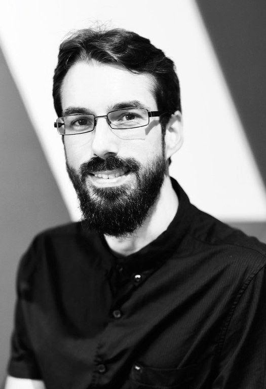

## [Home](/ema-webpage/) - [Publications](/ema-webpage/content/publications) - [CV](/ema-webpage/content/cv) - [Material](/ema-webpage/content/material) - [Research](/ema-webpage/content/research) - [Contact](/ema-webpage/content/contact)

*All things are possible,*  
*perhaps nothing is certain,*  
*but some things are more likely than others.*  

I am a [CNRS] researcher at ([Université
Côte d’Azur][UCA], CNRS) based in Sophia Antipolis, and a member of the [COATI
Project-Team][COATI] between [INRIA] and [I3S][I3S] .

<a itemprop="sameAs" content="https://orcid.org/0000-0002-8755-3892" href="https://orcid.org/0000-0002-8755-3892" target="orcid.widget" rel="me noopener noreferrer" style="vertical-align:top;">https://orcid.org/0000-0002-8755-3892</a>

 

## About

Before accepting a CNRS position in 2018, I've been a fellow of the [*Simons Institute for the Theory of Computing*](https://simons.berkeley.edu/) in the Brain and Computation Program and a postdoctoral fellow at the [*Max Planck Institute for Informatics*](https://www.mpi-inf.mpg.de/departments/algorithms-complexity).
In 2019, I've received the *Best Italian Young Researcher in Theoretical Computer Science* award by the Italian Chapter of the European Association of Theoretical Computer Science, from which I also received the *Best PhD Thesis in Theoretical Computer Science* in 2017. In 2016, I've been a recipient of the *Best Student Paper Award* at the European Symposium on Algorithms.

### Research

I'm currently working on questions which fall at the interface between computational neuroscience and artificial neural networks. 
More recently, I've been learning the [Julia programming language](https://julialang.org/) and I've become interested in the sub-area of scientific computing known as *Scientific Machine Learning*, with the goal of contributing to a more environmentally sustainable society through the means of computational modeling and simulation.
[Here](content/misc.md) I  give a quick overview of my research. 

## Current group members 

### PhD students

* [Arthur Carvalho Walraven Da Cunha](https://arthurwalraven.github.io/)
* [Francesco D'Amore](https://sites.google.com/view/francesco-damore/home)  

### Research engineers

* [Paulo Bruno Serafim](https://paulobruno.github.io/)

[UCA]: http://univ-cotedazur.fr 
[COATI]: https://team.inria.fr/coati/team-members 
[I3S]: http://www.i3s.unice.fr
[CNRS]: https://www.cnrs.fr/
[INRIA]: https://www.inria.fr/en/inria-centre-universite-cote-azur
